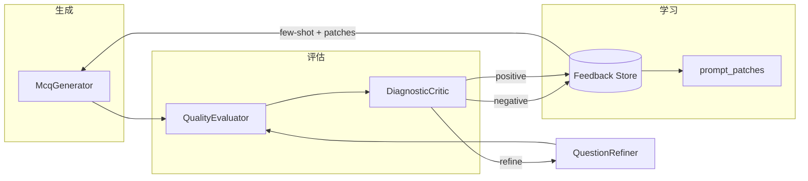
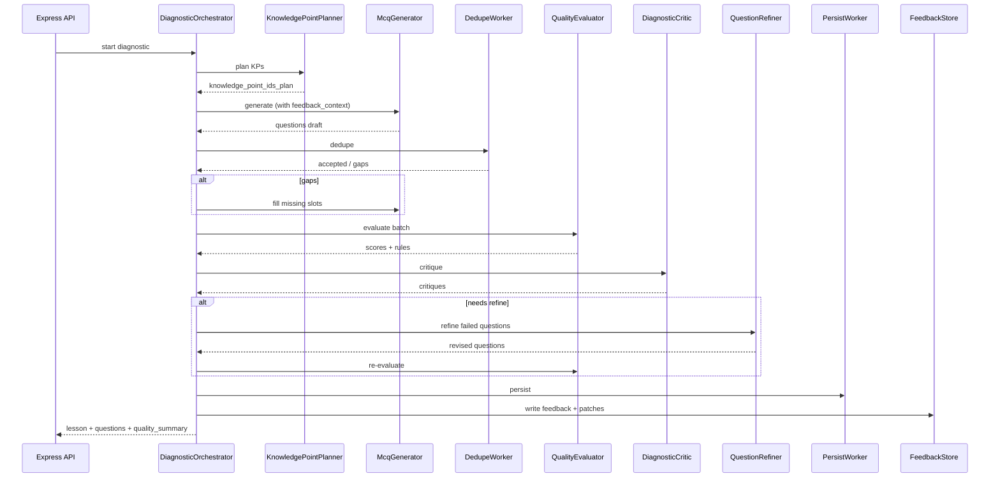

# Max AI Learning 多智能体架构方案

> 版本：v1.0  
> 状态：设计稿（待实现）  
> 关联文档：[`diagnostic-quality-evaluation.md`](./diagnostic-quality-evaluation.md)  
> 适用范围：诊断出题、质量评估、反馈自改进

---

## 1. 目标

在现有 **Express API + PostgreSQL + Pinecone + Ragas 评估** 基础上，引入多智能体协作，实现：

1. **按职责拆分**出题流程（规划、生成、去重、入库、评估）
2. **评审智能体**读取 `audit_log` / LangWatch 分数，给出可执行的改进建议
3. **反馈闭环**：低分批次 → 负例库 + prompt 补丁 → 下一轮出题质量提升
4. **渐进迁移**：Express 保留为 API 网关；智能体核心用 **Python** 实现（与 Ragas 同栈）

本方案 **不要求** 一次性替换 Express，也 **不以 fine-tune 模型** 为第一手段；优先做 **评估驱动的 prompt / 示例迭代**。

---

## 2. 现状 vs 目标

### 2.1 现状（单体 LLM 调用）

```
HTTP diagnostic 请求
  → Express 查 DB（grade/subject/KP）
  → 拼 prompt（prompts.js diagnostic.*）
  → 单次 GPT 生成 5 题 JSON
  → metadata / 语义去重
  → 入库 + 返回前端
  → 异步：Layer A 规则 + Layer B Judge + Ragas + LangWatch
```

**痛点：**

- 规划、出题、质检耦合在一次 GPT 调用里
- 评估结果只写 `audit_log.jsonl`，**未回流**给出题逻辑
- Ragas / Judge 在 Node 与 Python 间分裂，长期维护成本高

### 2.2 目标（多智能体 + 反馈环）

```
HTTP diagnostic 请求
  → Express（或未来 FastAPI 网关）
  → Orchestrator 启动一轮 Diagnostic Run
  → Router / Planner 分配 KP
  → Generator Worker 按题生成
  → Dedupe Worker 去重
  → Evaluator（规则 + Judge + Ragas）打分
  → Critic 汇总失败原因
  → 未达标 → Refiner 迭代（最多 N 轮）
  → 达标 → Persist Worker 入库
  → Feedback Store 更新（正/负例、prompt 补丁）
  → 返回前端
```

---

## 3. 角色映射（通用 → 本项目）

| 通用角色 | 本项目中的对应 | 是否 Phase 1 需要 |
|----------|----------------|-------------------|
| **Orchestrator / Supervisor** | `DiagnosticOrchestrator` | 是 |
| **Router** | `IntentRouter`（诊断 / 练习 / 分析） | 部分（先固定 diagnostic） |
| **Worker / Specialist** | Planner、Generator、Dedupe、Persist、Retrieval | 是（分阶段） |
| **Critic / Evaluator / Refiner** | `QualityEvaluator` + `DiagnosticCritic` + `QuestionRefiner` | 是 |

---

## 4. 智能体清单

### 4.1 Orchestrator — `DiagnosticOrchestrator`

**职责：** 一次诊断运行的「总导演」。

| 项 | 说明 |
|----|------|
| 输入 | `userId`, `gradeId`, `subjectId`, `lang`, `numQuestions`（默认 5） |
| 输出 | `{ lesson, questions[], run_id, quality_summary }` |
| 全局状态 | `DiagnosticRunState`（见 §6） |
| 工具 | 调用各 Worker / Critic；控制最大迭代次数 |

**流程：**

```
init state → planner → generate batch → dedupe → evaluate
  → if pass: persist & return
  → else: critic → refiner → regenerate failed slots → re-evaluate (≤ max_retries)
```

**与现网关系：** 初期封装现有 `diagnostic.js` + `dbFirstSelectAndMaybeGenerateWithGpt`；逐步改为逐步调用各 Worker。

---

### 4.2 Router — `IntentRouter`

**职责：** 按用户意图分流到不同编排流程（轻量网关，不做长周期规划）。

| 路由目标 | 触发条件 | 下游 Orchestrator |
|----------|----------|-------------------|
| `diagnostic` | `POST /diagnostic/generate` | `DiagnosticOrchestrator` |
| `practice` | `POST /practice/generate` | `PracticeOrchestrator`（未来） |
| `analysis` | 学情分析相关 API | `AnalysisOrchestrator`（未来） |

**Phase 1：** Router 可硬编码为 `diagnostic`，保留接口形状便于扩展。

**示例：**

```text
用户请求 → IntentRouter
  ├─ diagnostic  → DiagnosticOrchestrator
  ├─ practice    → PracticeOrchestrator
  └─ analysis    → AnalysisOrchestrator
```

---

### 4.3 Worker 智能体

#### 4.3.1 Planner — `KnowledgePointPlanner`

**职责：** 决定本批 5 题考哪些 KP（替代/增强 `buildKnowledgePointIdsPlan`）。

| 输入 | `knowledge_points[]`, `student_profile`, 历史薄弱 KP |
| 输出 | `knowledge_point_ids_plan[5]`, `plan_rationale` |
| 工具 | `query_student_kp_scores`, `query_recent_diagnostic_kps` |

**规则：**

- 不发明新 KP，只从 DB 已有列表中选
- 优先覆盖学生薄弱 / 少考过的 KP
- 5 题尽量分散（与现有 `kp_coverage` 指标一致）

---

#### 4.3.2 Generator — `McqGenerator`

**职责：** 按 plan 生成 MCQ（垂域专家，专注 JSON 结构 + 双语 + metadata）。

| 输入 | `plan[]`, `knowledge_points`, `grade_guidance`, `feedback_context` |
| 输出 | `questions[]`（含 `content_*`, `options`, `answer_*`, `explanation_*`, `metadata`, `knowledge_point_id`） |
| System Prompt | 精简版，从 `backend/lib/prompts.js` → `diagnostic.*` 迁移 |
| 工具 | 无外部 API；可选 `get_few_shot_examples(kp_id)` |

**`feedback_context`（自改进关键）：** 由 Feedback Store 注入，例如：

```json
{
  "avoid_patterns": ["kp_alignment 低：题面考词汇但 KP 是阅读理解"],
  "few_shot_good": [{ "kp_id": 42, "question": "...", "scores": { "kp_alignment": 0.95 } }],
  "prompt_patches": ["数学题必须自检 metadata.nums 与答案一致"]
}
```

---

#### 4.3.3 Retrieval — `ContextRetrievalAgent`（可选 / Phase 2+）

**职责：** 从 Pinecone / DB 拉取与 KP 相关的片段，供 Generator 参考（**非 RAG 问答**，而是「出题素材」）。

| 输入 | `knowledge_point_id`, `grade_id`, `subject_id` |
| 输出 | `retrieval_snippets[]` |
| 工具 | `pinecone_query`, `db_query_similar_questions` |

> 当前 diagnostic prompt 中 `retrieval_snippets` 多为空；启用后可提高 `kp_alignment`，并为未来 faithfulness 类指标留口子。

---

#### 4.3.4 Dedupe — `QuestionDedupeWorker`

**职责：** metadata / 语义 / Pinecone 去重（封装现有 dedupe 逻辑）。

| 输入 | 候选 `questions[]`, `grade_id`, `subject_id` |
| 输出 | `accepted[]`, `rejected[]` + 原因 |
| 工具 | `metadata_similarity`, `embedding_similarity`, `pinecone_dedupe` |

**特点：** 确定性为主，**不用 LLM**；失败时向 Orchestrator 报告需补题数量。

---

#### 4.3.5 Persist — `QuestionPersistWorker`

**职责：** 写入 PostgreSQL + Pinecone metadata（封装现有 INSERT / upsert）。

| 工具 | `db_insert_question`, `pinecone_upsert_qmeta` |

---

### 4.4 Critic / Evaluator / Refiner

#### 4.4.1 Evaluator — `DiagnosticQualityEvaluator`

**职责：** 质量守门员第一层 — **可复现的打分**（非生成）。

整合现有 Phase 1 + Phase 2（见 `diagnostic-quality-evaluation.md`）：

| 层 | 实现 | 输出 |
|----|------|------|
| Layer A | `diagnosticEvalRules.js` → 迁 Python | `rules`, `all_pass` |
| Layer B | `diagnosticEvalJudge.js` → 迁 Python | `kp_alignment`, `explanation_support`, `distractor_quality` |
| Layer C | 批次聚合 | `rule_pass_rate`, `mean_kp_alignment`, … |
| 可选 | `evaluate_ragas.py` | `answer_relevancy` |

**单题输出示例：**

```json
{
  "index": 0,
  "scores": {
    "kp_alignment": 0.3,
    "explanation_support": 1,
    "distractor_quality": 0.7,
    "response_relevancy": 0.82
  },
  "rules": { "answer_in_options": true, "kp_plan_match": true },
  "judge_reasons": { "kp_alignment": "题面考问候语，KP 是 Show-and-tell" }
}
```

---

#### 4.4.2 Critic — `DiagnosticCritic`

**职责：** 质量守门员第二层 — **把分数翻译成改进指令**（Reflection Pattern）。

| 输入 | Evaluator 的 per-question 结果 + `eval_context` |
| 输出 | `critiques[]`：每题一条可执行建议 |
| 不做什么 | 不直接改题；只产出 structured feedback |

**示例输出：**

```json
{
  "index": 0,
  "severity": "high",
  "issues": ["kp_alignment_low"],
  "instruction": "Rewrite so the question assesses 'Show-and-tell' (student presents and responds), not generic greetings.",
  "target_kp_id": 23
}
```

**通过阈值（可调）：**

| 条件 | 动作 |
|------|------|
| `rules.all_pass === false` | 必须 Refine 或丢弃 |
| `kp_alignment < 0.7` | Refine |
| `distractor_quality < 0.6` | Refine |
| `response_relevancy < 0.5` | Refine |
| 批次 `mean_kp_alignment < 0.7` | 记录到 Feedback Store，即使单题未触发 Refine |

---

#### 4.4.3 Refiner — `QuestionRefiner`

**职责：** 根据 Critic 指令改写 **单题**，不整批重生成。

| 输入 | 原题 JSON + `critique.instruction` + KP 上下文 |
| 输出 | 修订后单题 |
| 上限 | 每题最多 `max_refine_attempts`（建议 2） |

---

## 5. 反馈自改进（核心闭环）

### 5.1 原则

- **不先 fine-tune**；用「评估 → 结构化反馈 → prompt / 示例库」迭代
- 所有改进 **可追溯**：`run_id` → `audit_log` → `feedback_events`

### 5.2 Feedback Store（建议新表）

```sql
-- 批次级
CREATE TABLE diagnostic_runs (
  id UUID PRIMARY KEY,
  user_id INT,
  grade_id INT,
  subject_id INT,
  lang TEXT,
  batch_scores JSONB,
  status TEXT,  -- ok | partial | failed
  created_at TIMESTAMPTZ DEFAULT NOW()
);

-- 题级反馈（供下轮 Generator 检索）
CREATE TABLE question_feedback (
  id SERIAL PRIMARY KEY,
  run_id UUID REFERENCES diagnostic_runs(id),
  knowledge_point_id INT,
  question_snapshot JSONB,
  scores JSONB,
  judge_reasons JSONB,
  critique JSONB,
  label TEXT,  -- positive | negative | neutral
  used_in_prompt_at TIMESTAMPTZ,
  created_at TIMESTAMPTZ DEFAULT NOW()
);

-- KP / 学科级 prompt 补丁（人工可编辑）
CREATE TABLE prompt_patches (
  id SERIAL PRIMARY KEY,
  scope TEXT,       -- global | grade_subject | knowledge_point
  scope_id TEXT,
  patch_text TEXT,
  source_run_id UUID,
  active BOOLEAN DEFAULT TRUE,
  created_at TIMESTAMPTZ DEFAULT NOW()
);
```

### 5.3 自改进循环



**正例入库：** `kp_alignment >= 0.85` 且 `rules.all_pass` → `label=positive`，作为 few-shot。  
**负例入库：** 任一项低于阈值 → `label=negative`，附 `judge_reasons` + `critique`。

### 5.4 Generator 如何使用反馈

下一轮 `McqGenerator` 的 prompt 动态拼接：

1. `get_prompt_patches(grade_id, subject_id, kp_id)`
2. `get_few_shot_examples(kp_id, label=positive, limit=2)`
3. `get_avoid_patterns(kp_id, label=negative, limit=3)` — 只取 reason 摘要，不塞整题

---

## 6. 全局状态 `DiagnosticRunState`

Orchestrator 持有的共享上下文（LangGraph State 或等价结构）：

```typescript
interface DiagnosticRunState {
  run_id: string;
  request: { userId; gradeId; subjectId; lang; numQuestions };
  student_profile: object;
  knowledge_points: KnowledgePoint[];
  plan: number[];                    // length 5
  questions: Question[];             // 当前批次
  dedupe_rejected: Question[];
  evaluation: {
    batch: BatchMetrics;
    rows: QuestionEvalRow[];
  };
  critiques: Critique[];
  refine_round: number;
  max_refine_rounds: number;         // default 2
  feedback_written: boolean;
  status: 'planning' | 'generating' | 'deduping' | 'evaluating' | 'refining' | 'persisting' | 'done' | 'failed';
}
```

---

## 7. 端到端时序



---

## 8. 技术栈建议

| 层级 | 选型 | 理由 |
|------|------|------|
| Agent 运行时 | **Python 3.11+** | 与 Ragas、评估脚本同栈 |
| Agent 框架 | **LangGraph**（首选）或 CrewAI | 显式状态图，适合 Orchestrator + 条件分支 + 重试 |
| Agent API | **FastAPI** | 异步、易部署 Render |
| 现有 API | **Express（过渡期）** | 鉴权、用户、静态路由不变 |
| 评估 | 合并到 Python 服务 | 规则 + Judge + `evaluate_ragas.py` |
| 观测 | LangWatch | 每题一条 span，OUTPUT 为分数 JSON（已实现） |
| 队列（可选） | Redis / DB job 表 | 长耗时 diagnostic 异步化 |

**不推荐现阶段：** 全量迁 .NET（Ragas 仍在 Python；agent 实验成本高）。

### 8.1 目录结构（建议）

```
maxailearning/
  agents/                          # 新建 Python 服务
    app/
      main.py                      # FastAPI
      orchestrators/
        diagnostic.py
      agents/
        planner.py
        generator.py
        critic.py
        refiner.py
        evaluator.py
      workers/
        dedupe.py
        persist.py
      feedback/
        store.py
        retrieval.py
      state/
        diagnostic.py
      tools/
        db.py
        pinecone.py
        openai_client.py
    pyproject.toml
  backend/                         # Express（逐步变薄）
  ragas/                           # 逐步并入 agents/evaluator
  specs/
    diagnostic-quality-evaluation.md
    multi-agent-architecture.md    # 本文档
```

### 8.2 Express 与 Python 协作

| 阶段 | Express | Python Agents |
|------|---------|---------------|
| Phase A | 仍负责 diagnostic HTTP | 仅异步评估 + 写 Feedback |
| Phase B | 转发 diagnostic 到 Python | Orchestrator 端到端出题 |
| Phase C | 仅 auth / 用户 / 静态资源 | 全部业务智能体 |

内部调用：`POST http://agents:8000/internal/diagnostic/run`

---

## 9. 与现有评估方案对齐

| 文档 / 代码 | 在多智能体中的位置 |
|-------------|-------------------|
| `diagnosticEvalRules.js` | → `QualityEvaluator` Layer A |
| `diagnosticEvalJudge.js` | → `QualityEvaluator` Layer B |
| `evaluate_ragas.py` | → `QualityEvaluator` 可选 Ragas 指标 |
| `audit_log.jsonl` | → 写入 `diagnostic_runs` + 文件备份 |
| LangWatch `diagnostic-qN` | → Orchestrator 在评估后上报 |

Critic 使用的阈值与 [`diagnostic-quality-evaluation.md` §8](./diagnostic-quality-evaluation.md) 解读表一致。

---

## 10. 实施路线图

### Phase A — 反馈基础设施（1–2 周）

- [x] 新建 `question_feedback` / `diagnostic_runs` 表
- [x] 评估完成后异步写入 Feedback Store（Express 侧可先写）
- [x] 从 Feedback 读 few-shot / patches 注入 prompt（最小闭环）

### Phase B — Python Agent 服务骨架（2–3 周）

- [x] `agents/` FastAPI + LangGraph `DiagnosticOrchestrator`
- [x] 迁移 `QualityEvaluator`（规则 + Judge）到 Python
- [x] `DiagnosticCritic` + `QuestionRefiner` 单题迭代
- [x] Express `agentClient.js`：设置 `AGENTS_SERVICE_URL` 时走 Python 质量链路

### Phase C — Worker 拆分（2–4 周）

- [x] `KnowledgePointPlanner` 独立（`backend/lib/knowledgePointPlanner.js` + `agents/app/agents/planner.py`）
- [x] `McqGenerator` 从 monolithic prompt 拆出（`agents/app/agents/generator.py` + `app/prompts/diagnostic.py`）
- [x] `DedupeWorker` / `PersistWorker` 封装（`questionDedupeWorker.js`、`questionPersistWorker.js`、`agents/app/workers/`）
- [x] `POST /v1/diagnostic/run` 端到端编排 + `AGENTS_DIAGNOSTIC_RUN=1` Express 委托

### Phase D — 检索与进阶（可选）

- [ ] `ContextRetrievalAgent` + Pinecone 片段
- [ ] `IntentRouter` 扩展 practice / analysis
- [ ] 批次级告警（低 `mean_kp_alignment` webhook）

---

## 11. 非目标（当前版本）

- 不做学生端多智能体对话 UI
- 不默认 fine-tune 开源模型
- 不替换 Neon / Render 部署形态
- 不要求 LangWatch 承担 Critic 逻辑（仅观测）

---

## 12. 成功指标

| 指标 | 基线 | 目标（3 个月内） |
|------|------|------------------|
| `batch.mean_kp_alignment` | ~0.6–0.7 | ≥ 0.8 |
| `rule_pass_rate` | ~1.0 | 保持 1.0 |
| 低分题重试后通过率 | — | ≥ 70% 在 1 次 Refine 内达标 |
| 同 KP 重复低分率 | — | 环比下降（Feedback 生效） |

---

## 13. 决策记录

| 日期 | 决策 |
|------|------|
| 2026-07-05 | 智能体核心语言选 **Python**，Express 渐进退场 |
| 2026-07-05 | 自改进优先 **Feedback Store + prompt/示例**，非 fine-tune |
| 2026-07-05 | Critic 阈值与 `diagnostic-quality-evaluation.md` 对齐 |
| 2026-07-05 | Orchestrator 采用 LangGraph 状态图建模 |

---

## 14. 附录：单题质量卡片（运营可读）

评估 + Critic 完成后，每题可生成一张「质量卡片」供内部查看：

```json
{
  "question_preview": "哪种材料通常用来拼贴制作？",
  "knowledge_point": "材料与技法",
  "scores": {
    "kp_alignment": 1,
    "explanation_support": 1,
    "distractor_quality": 0.8,
    "response_relevancy": 0.35
  },
  "verdict": "结构合格；答案与题干相关性偏弱，建议改写题干或标答表述",
  "action": "none | refine | archive_negative | promote_positive"
}
```

这与 LangWatch 每题 **一条** `diagnostic-qN`、OUTPUT 为纯分数 JSON 的展示方式一致。
